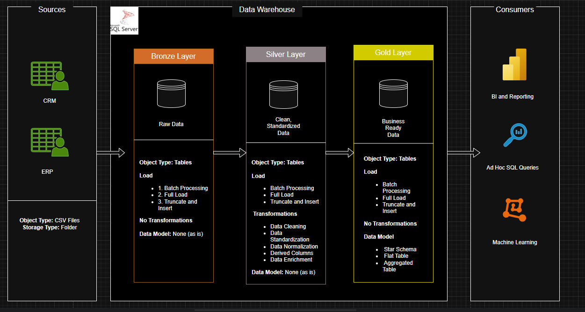

# SQL Data Warehouse Project 

This project demonstrates the end-to-end development of a modern SQL-based data warehouse, following best practices used in real-world enterprise data environments.

> **Portfolio Page:** [Notion Project Page](https://sirgicheha.notion.site/SQL-Data-Warehouse-2173b978e39a80468dacdbb1d85c8874)
---

##  Overview

A scalable, layered architecture that transforms raw source data (CRM & ERP) into clean, business-ready analytics using SQL Server and the Medallion architecture (Bronze, Silver, Gold).

**Key Features:**
- Complete ETL process with raw-to-report lineage
- Star schema data model optimized for reporting
- Automated stored procedures with logging
- Data quality checks and business rule enforcement
- Fully documented diagrams, data catalog, and project plan

---

##  Architecture

- **Bronze Layer:** Raw data ingestion (CSV → SQL)
- **Silver Layer:** Cleansed and enriched data
- **Gold Layer:** Star schema model (fact & dimensions)

---

##  Tech Stack

- SQL Server Express + SQL Server Management Studio
- Git for version control
- [Draw.io](http://draw.io/) for diagramming
- Notion for project planning

---

##  ETL Workflows

### Bronze

- Schema mirrors source structure
- Full reload using `BULK INSERT`
- Basic validation (row count, schema match)

### Silver

- Cleansing: deduplication, normalization, null handling
- Standardized with metadata (`dw_create_date`)
- Full load with `load_silver` stored procedure

### Gold

- Fact + dimension views with surrogate keys
- Business rules enforced
- Optimized for reporting tools

---

##  Documentation

- [Architecture Diagrams](assets/data_architecture.png)
- [Data Catalog](docs/)
- [SQL Scripts](scripts/)
- [Project Plan](https://www.notion.so/Data-Warehouse-Project-Plan-and-Tasks-2083b978e39a8084aadbdff3f2584d25?pvs=21)

---

##  Best Practices Demonstrated

- Medallion architecture for modularity
- SQL window functions for deduplication, ranking, surrogate keys
- Stored procedures with robust error handling
- Reusable scripts and clean folder structure
- Clear naming conventions and documentation

---
